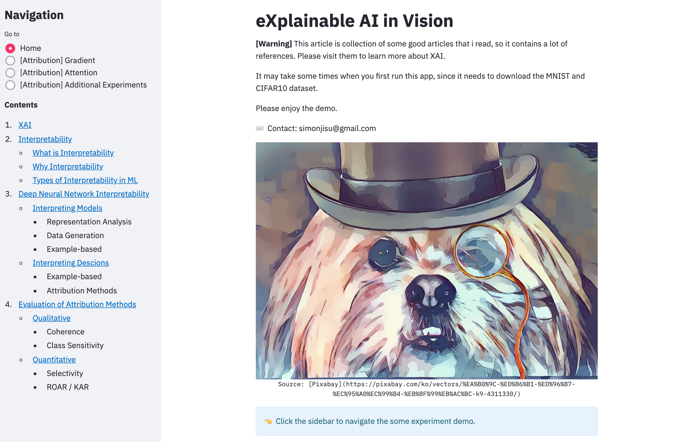

## XAI

* eXplainable AI
* AI college Recording Repo



can see the demo at [http://app.soopace.com](http://app.soopace.com) (not always on) or run it by docker at local

## Requirements

```
python == 3.7
pytorch == 1.7.1
torchvision == 0.8.2
jupyter >= 1.0.0
```

## Run in Docker

```
$ docker pull https://
```

## Run in local

### 1. install requirements packages
* [[pytorch]](https://pytorch.org/) install with your environments
* [[jupyter]](https://jupyter.readthedocs.io/en/latest/install.html) better to install with anaconda
* [[streamlit]](https://docs.streamlit.io/en/stable/installation.html) install via pip


### 2. quick tutorial

run following scripts to download all model weights(1.4GB), you can also download from [google drive](https://drive.google.com/file/d/1Av8B5gjKVL-vM-TvivKL1wNXmvaA4DMO/view?usp=sharing)

```
$ sh download-weight.sh
```

run streamlit application 

```
$ streamlit run app.py
```

after this go to browser http://localhost:8501

### 3. training from scratch

you can also train from scratch if you want. You can choose 3rd argument in "experiments" by following:
* 1: `plain` 
* 2: `rcd`
* 3: `rcd-fgm`
* 4: `rcd-noabs`

> options means:
>    * `plain`: basic setting
>    * `rcd`: gray scale for all attribution methods(means that reducing the color dimension to 1)
>    * `fgm`: fill the masks with global mean of all datas instead of zeros.
>    * `noabs`: not to absolute attribution scores in some methods

```bash
# 1: data-type: one of 'mnist', 'cifar10'
# 2: eval-type: one of 'roar', 'kar'
# 3: experiments: one of 1~4
# 4: if you train the model first time(for each data-type), 
#    ensure this variable to `true`
$ sh fast-run $1 $2 $3 $4
```